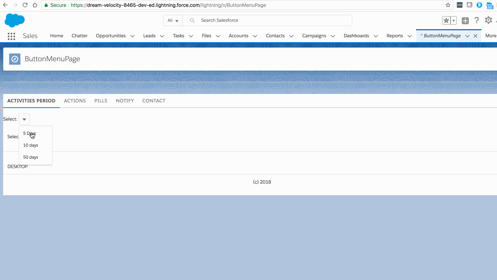
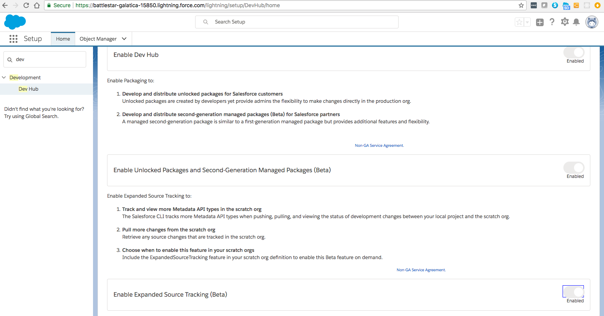

#  Training Tracker Application

## Goals

- Show the SFDX packaging concepts
- Show usage info for most of the lightning components


### Demo - ButtonMenu



```bash

## enable package2 in DEV hub
$ sfdx force:auth:web:login 
Successfully authorized mohan.chinnappan.dh201@gmail.com with org ID 00D1H000000NSUhUAO
You may now close the browser


```



``` bash

## Create unlocked package2
$ sfdx force:package2:create -o Unlocked -n "TrainingTracking App 2018.06.18 6:27"
WARNING: The command "force:package2:create" has been deprecated and will be removed in v43.01.0 or later. Use "force:package:create" instead.
Successfully created a second-generation package (package2). 0Ho1H0000004CABSA2 0331H00000025buQAA
=== Ids
NAME                   VALUE
─────────────────────  ──────────────────
Package2 Id            0Ho1H0000004CABSA2
Subscriber Package Id  0331H00000025buQAA


## list the packages
$ sfdx force:package2:list 
WARNING: The command "force:package2:list" has been deprecated and will be removed in v43.01.0 or later. Use "force:package:list" instead.
=== Package2 Packages [1]
NAMESPACE PREFIX  NAME                                  ID                  SUBSCRIBER PACKAGE2 ID  DESCRIPTION  OPTIONS
────────────────  ────────────────────────────────────  ──────────────────  ──────────────────────  ───────────  ────────
                  TrainingTracking App 2018.06.18 6:27  0Ho1H0000004CABSA2  0331H00000025buQAA                   Unlocked


## Update the version in the sfdx-project.json

vi sfdx-project.json 

$ cat sfdx-project.json 
{
  "packageDirectories": [
    {
      "path": "force-app",
      "id":"0Ho1H0000004CABSA2",
      "versionName": "Training Tracking App",
      "versionNumber": "1.0.0.NEXT",

      "default": true
    }
  ],
  "namespace": "",
  "sfdcLoginUrl": "https://login.salesforce.com",
  "sourceApiVersion": "43.0"
}


## Create the version
$ sfdx force:package2:version:create  -i 0Ho1H0000004CABSA2
WARNING: The command "force:package2:version:create" has been deprecated and will be removed in v43.01.0 or later. Use "force:package:version:create" instead.
Package2 version creation request is InProgress. Run "sfdx force:package2:version:create:get -i 08c1H0000004CAGQA2" to query for status.

# create status
$ sfdx force:package2:version:create:get -i 08c1H0000004CAGQA2
WARNING: The command "force:package2:version:create:get" has been deprecated and will be removed in v43.01.0 or later. Use "force:package:version:create:report" instead.
=== Package2 Version Create Request
NAME                            VALUE
──────────────────────────────  ──────────────────
ID                              08c1H0000004CAGQA2
Status                          InProgress
Package2 Id                     0Ho1H0000004CABSA2
Package2 Version Id
Subscriber Package2 Version Id
Tag
Branch
Created Date                    2018-06-18 06:36
Installation URL

## Success

$ sfdx force:package2:version:create:get -i 08c1H0000004CAGQA2
WARNING: The command "force:package2:version:create:get" has been deprecated and will be removed in v43.01.0 or later. Use "force:package:version:create:report" instead.
=== Package2 Version Create Request
NAME                            VALUE
──────────────────────────────  ─────────────────────────────────────────────────────────────────────────────────
ID                              08c1H0000004CAGQA2
Status                          Success
Package2 Id                     0Ho1H0000004CABSA2
Package2 Version Id             05i1H0000004CAGQA2
Subscriber Package2 Version Id  04t1H000000uy0ZQAQ
Tag
Branch
Created Date                    2018-06-18 06:36
Installation URL                https://login.salesforce.com/packaging/installPackage.apexp?p0=04t1H000000uy0ZQAQ

#### Install the package to the org

$ sfdx force:package:install --package 04t1H000000uy0ZQAQ
PackageInstallRequest is currently InProgress. You can continue to query the status using
sfdx force:package:install:report -i 0Hf0q000000CbQtCAK -u test-l6fcbhvdzwnf@example.com

### Check the install status

$ sfdx force:package:install:report -i 0Hf0q000000CbQtCAK -u test-l6fcbhvdzwnf@example.com


```

### Org shape pilot

```bash

## create  a snapshot of org edition, features, and licenses 
$ sfdx force:org:shape:create -h
Usage: sfdx force:org:shape:create [-u <string>] [--json] [--loglevel <string>] 

create a snapshot of org edition, features, and licenses

Flags:
 -u, --targetusername TARGETUSERNAME  username or alias for the target org;
                                      overrides default target org
 --json                               format output as json
 --loglevel LOGLEVEL                  logging level for this command invocation
                                      (error*,trace,debug,info,warn,fatal)

Examples:
   $ sfdx force:org:shape:create -u me@my.org
   $ sfdx force:org:shape:create -u me@my.org --json --loglevel debug


## List all org shapes you’ve created
$ sfdx force:org:shape:list -h
Usage: sfdx force:org:shape:list [--json] [--loglevel <string>] 

list all org shapes you’ve created

Flags:
 --json               format output as json
 --loglevel LOGLEVEL  logging level for this command invocation
                      (error*,trace,debug,info,warn,fatal)

Examples:
   $ sfdx force:org:shape:list
   $ sfdx force:org:shape:list --json
   $ sfdx force:org:shape:list --json > tmp/MyOrgShapeList.json


## Delete all org shapes for a target org
$ sfdx force:org:shape:delete -h
Usage: sfdx force:org:shape:delete -u <string> [-p] [--json] [--loglevel <string>] 

delete all org shapes for a target org

Flags:
 -p, --noprompt                       do not prompt for confirmation
 -u, --targetusername TARGETUSERNAME  (required) username for the target org
 --json                               format output as json
 --loglevel LOGLEVEL                  logging level for this command invocation
                                      (error*,trace,debug,info,warn,fatal)

Examples:
   $ sfdx force:org:shape:delete -u me@my.org
   $ sfdx force:org:shape:delete -u MyOrgAlias -p
   $ sfdx force:org:shape:delete -u me@my.org --json
   $ sfdx force:org:shape:delete -u me@my.org -p --json > tmp/MyOrgShapeDelete.json


```

### How to signup for the Org Shape Pilot:

[Org Shape Pilot](https://developer.salesforce.com/docs/atlas.en-us.sfdx_cli_reference.meta/sfdx_cli_reference/cli_reference_force_org.htm)

